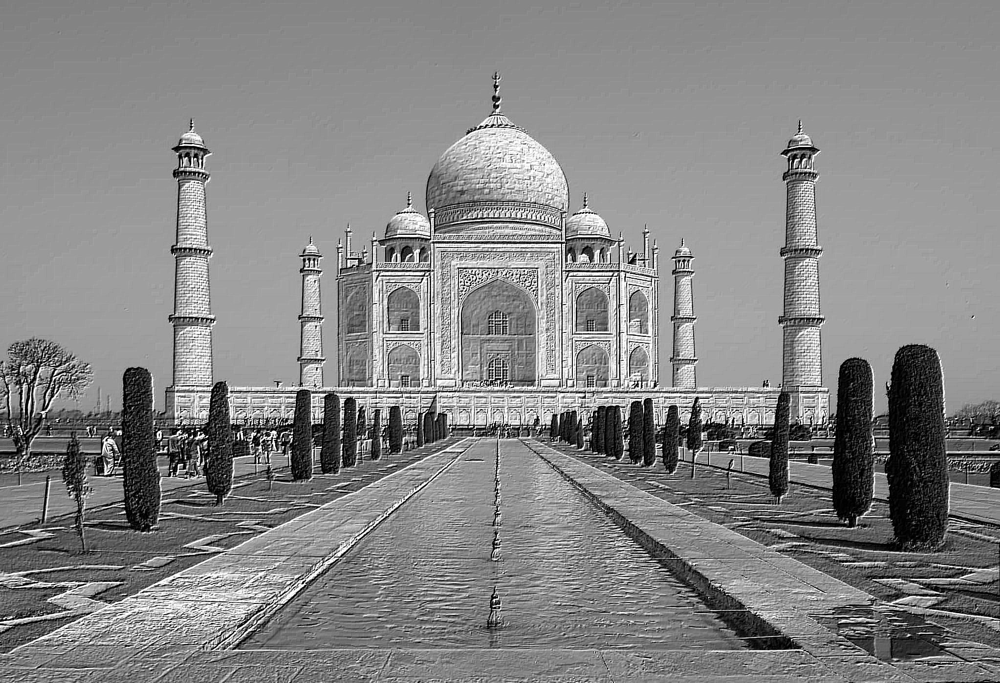
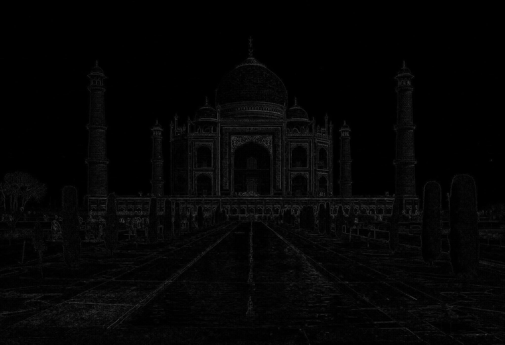

# Convolutional Operations
This is just a test of operations with the convolution algorithm.

## Jist to the algorithm
A convolution matrix filter uses two matrices, one of them is a matrix of the input image, whereas the other one is a matrix we choose based on the effect we want, and this matrix is called as the **kernel**. 

We perform a mathematical convolution between these matrices which is basically the multiplication of both these matrices pixelwise, while sliding the kernel over the entire image matrix. Sliding the kernel over different regions may result in different interesting patterns. Famous graphics editors like **gimp** work on this algorithm. 

## Results

ORIGINAL IMAGE
  

- This is a more sharper version of the original image. The image shown below was generated by sweeping the kernel over the entire image matrix and by taking the kernel matrix as `[[-2,-1,0],[-1,1,1],[0,1,2]]`. 

  

- The image shown below was generated by sweeping the kernel over the entire image matrix and by taking the kernel matrix as `[[0,1,0],[1,-4,1],[0,1,0]]`. 

- **Cropped Result** - On choosing a kernel of larger size, for example of size `30x30` for an input image of size `200x200`, we may see the cropping effect significantly.  

Original and cropped images

